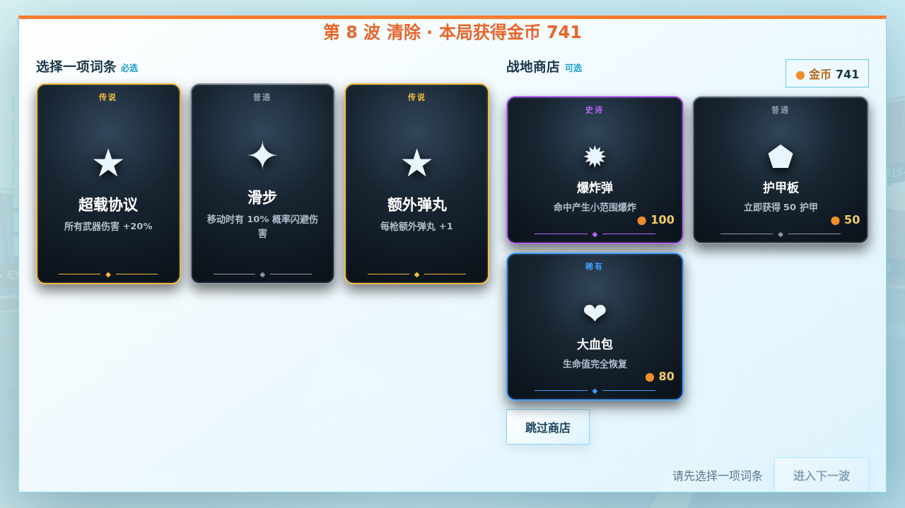
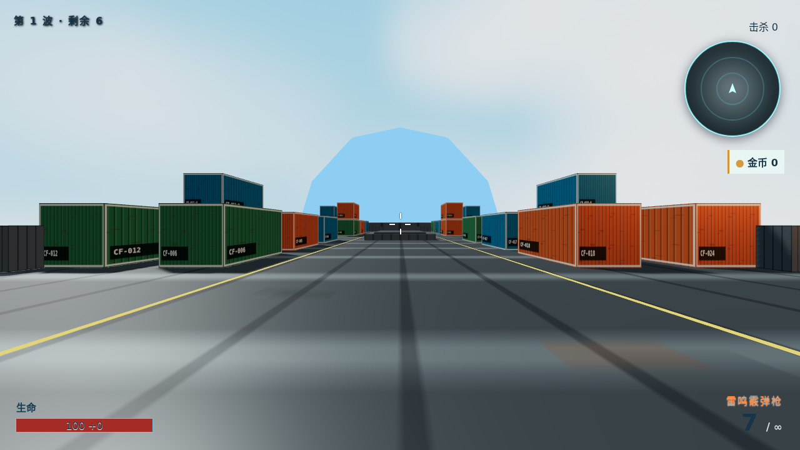

# 僵尸围城

一款完全本地打包、无 CDN 和外部素材依赖的 Three.js 3D FPS Roguelike。模型、地图、粒子与 WebAudio 音效均由代码生成。支持 PC 键鼠与手机横屏触屏双端。





## 在线试玩

https://zombie.oblfs.cc.cd (手机建议横屏)

## 运行与构建

```bash
npm install
npm run dev
npm run build
npm run preview
```

生产文件位于 `dist/`，Vite 使用相对资源路径，可直接部署到任意静态服务器或子目录。浏览器需要支持 WebGL；PC 推荐 Chrome，移动端支持最新版 Chrome/Safari，并建议横屏。

## 操作

- PC：WASD 移动，鼠标观察，左键射击，R 换弹，空格跳跃，Esc 暂停；数字键 1/2/3 切换三类装备武器。
- 手机：左半屏拖动移动，右半屏滑动观察；右侧按钮支持持续开火、换弹、切枪和跳跃。

## 目录

- `src/core/`：场景、渲染器、相机、事件总线、资源入口、主循环和游戏状态机
- `src/player/`：玩家移动、生命属性、可修饰属性和武器实例
- `src/weapons/`：三把武器的数据配置
- `src/enemies/`：程序化僵尸、类型注册表、AI 与对象池管理
- `src/systems/`：射击、波次、音效、粒子、弹痕、震屏与反馈
- `src/roguelike/`：30 个可选词条、修饰器叠层和事件型词条
- `src/map/`：120×120 地图、掩体、建筑和简化碰撞
- `src/input/`：PC/触屏适配器与统一语义输入
- `src/ui/`：菜单、HUD、词条选择、暂停和死亡结算
- `src/utils/`：通用对象池

## 扩展内容

### 新增武器

在 `src/weapons/weaponData.js` 的 `WEAPONS` 中增加一项，配置伤害、射速、弹匣、备弹、换弹、扩散、后坐力、弹丸数和自动射击。若要让玩家直接切换，再在 `Game.bind()` 的键位数组中加入该 ID；射击核心无需修改。

### 新增词条

在 `src/roguelike/buffPool.js` 添加配置。纯数值词条使用 `stat()`；事件词条提供 `apply(context, stack)`，通过 `context.listen()` 订阅 `weapon:shoot`、`shot:hit`、`enemy:killed`、`player:damaged` 或 `weapon:reloaded`。监听器会随一局结束卸载。

### 新增僵尸

在 `src/enemies/enemyTypes.js` 添加类型数据（生命、速度、伤害、缩放、颜色等），然后在 `WaveManager` 的生成规则中引用其 ID。所有类型复用 `Enemy` 的程序化人形、动画、碰撞与反馈；特殊行为可通过类型字段和事件实现。
